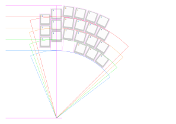
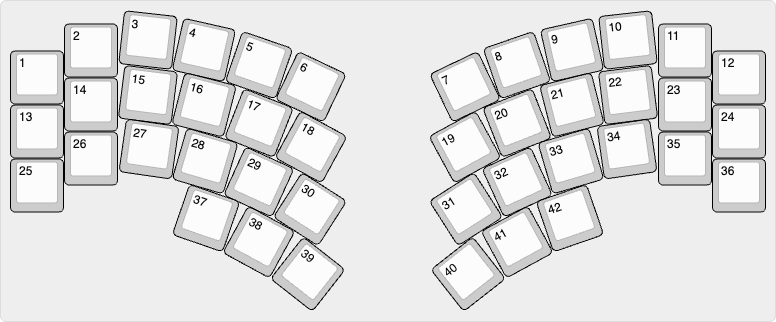

# Harmony 42

[![CC BY-SA 4.0][cc-by-sa-shield]][cc-by-sa]

A 42-key keyboard.

## Concept

## Layout

v0.1.0

- width: 14u
- depth: <6u

Made with Python script: 📁 [editor](layout/editor)

- 📄 [locations.csv](layout/locations.csv)
- 📄 [keyboard-layout.rawdata.json](layout/keyboard-layout.rawdata.json)

## License

This work is licensed under a
[Creative Commons Attribution-ShareAlike 4.0 International License][cc-by-sa].

[![CC BY-SA 4.0][cc-by-sa-image]][cc-by-sa]

[cc-by-sa]: http://creativecommons.org/licenses/by-sa/4.0/
[cc-by-sa-image]: https://licensebuttons.net/l/by-sa/4.0/88x31.png
[cc-by-sa-shield]: https://img.shields.io/badge/license-CC%20BY--SA%204.0-lightgrey.svg
