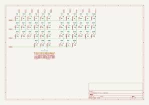
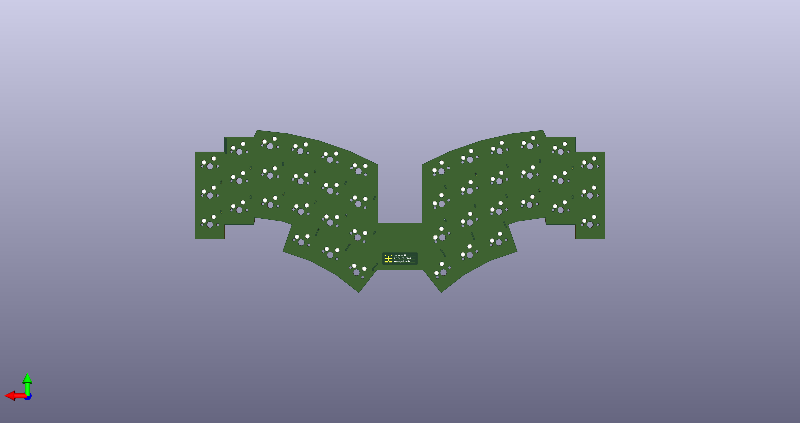
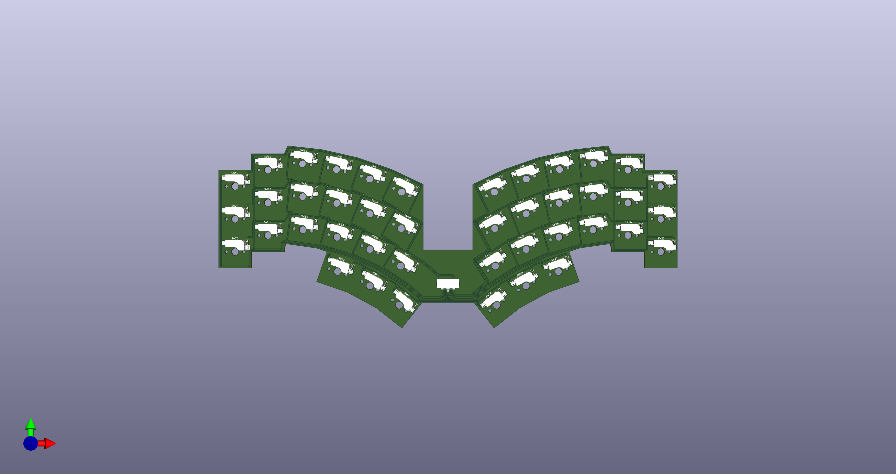

# Harmony 42

[![CC BY-SA 4.0][cc-by-sa-shield]][cc-by-sa]
[![KiCad][kicad-shield]][kicad]
[![Vial][vial-shield]][vial]

A 42-key keyboard.

## Concept

## Layout

v0.1.0

- width: 14u
- depth: <6u

Made with Python script: 📁 [editor](layout/editor)

- 📄 [locations.csv](layout/locations.csv)
- 📄 [keyboard-layout.rawdata.json](layout/keyboard-layout.rawdata.json)

## Schematic and PCB

KiCad files:

- 📄 [harmony-42-pcb.kicad_sch](electronics/harmony-42-pcb/harmony-42-pcb.kicad_sch) (v1.0.0)
- 📄 [harmony-42-pcb.kicad_pcb](electronics/harmony-42-pcb/harmony-42-pcb.kicad_pcb) (v1.0.0)

## Firmware

### Vial

- Built UF2
    - 📄 [takayoshiotake_harmony_42_vial_20240714.uf2](vial-bin/takayoshiotake_harmony_42_vial_20240714.uf2)

See [vial-porting](vial-porting) for more details.

## License

This work is licensed under a
[Creative Commons Attribution-ShareAlike 4.0 International License][cc-by-sa].

[![CC BY-SA 4.0][cc-by-sa-image]][cc-by-sa]

[cc-by-sa]: http://creativecommons.org/licenses/by-sa/4.0/
[cc-by-sa-image]: https://licensebuttons.net/l/by-sa/4.0/88x31.png
[cc-by-sa-shield]: https://img.shields.io/badge/license-CC%20BY--SA%204.0-lightgrey.svg

[kicad]: https://www.kicad.org/
[kicad-shield]: https://img.shields.io/badge/KiCad-314CB0.svg

[vial]: https://get.vial.today/
[vial-shield]: https://img.shields.io/badge/Vial-03045E.svg
