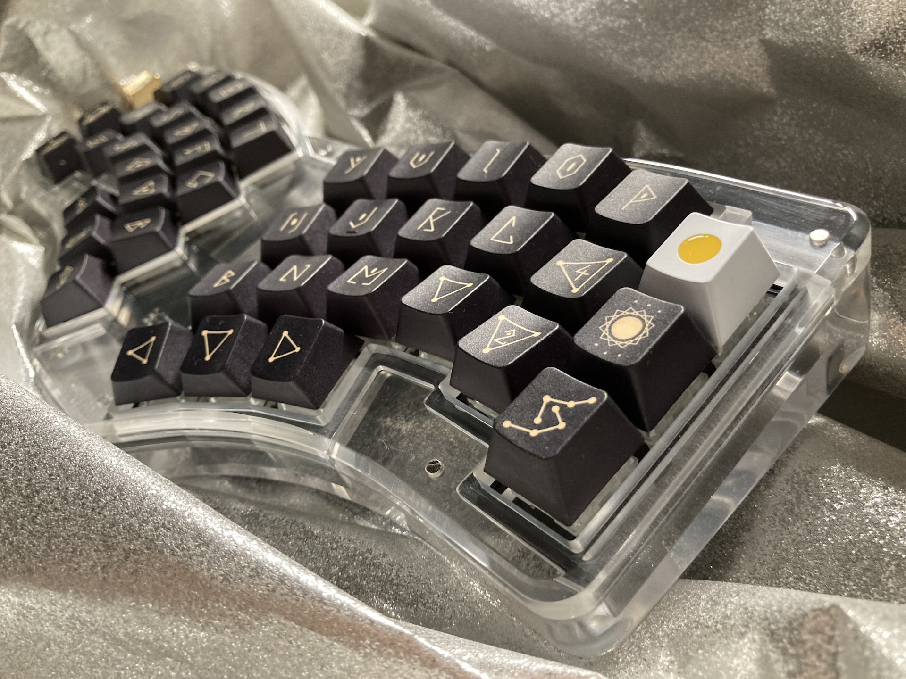
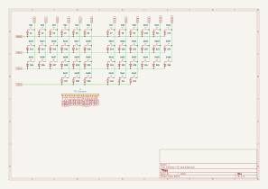
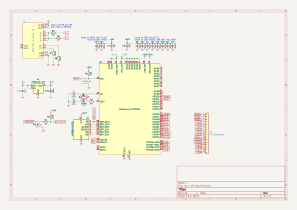
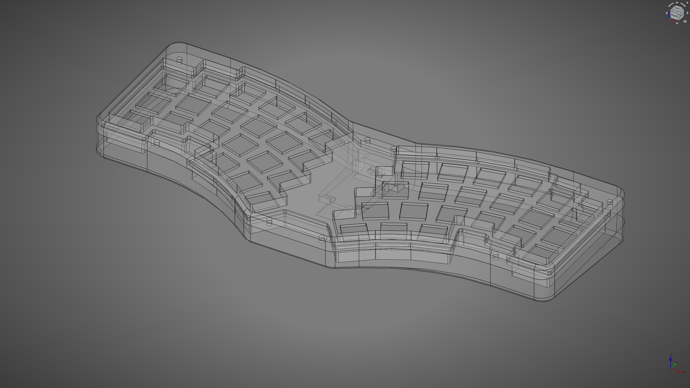

# Harmony 42

[![CC BY-SA 4.0][cc-by-sa-shield]][cc-by-sa]
[![FreeCAD][freecad-shield]][freecad]
[![Inkscape][inkscape-shield]][inkscape]
[![KiCad][kicad-shield]][kicad]
[![Vial][vial-shield]][vial]

A 42-key keyboard.

- Switch: TTC Frozen V2
- Keycap: StarryPoem + HIBI Artisan

## Concept

## Layout

v0.1.0

- width: 14u
- depth: <6u

Made with Python script: 📁 [editor](layout/editor)

- 📄 [locations.csv](layout/locations.csv)
- 📄 [keyboard-layout.rawdata.json](layout/keyboard-layout.rawdata.json)

## BOM

| Material | QTY | Note |
|-|-:|-|
| Harmony 42 PCB | 1 | [Schematic-and-PCB](#schematic-and-pcb) |
| MCU 16 PCB | 1 | [Schematic-and-PCB](#schematic-and-pcb) |
| Harmony 42 Case | 1 | PMMA CNC, [Mechanics](#mechanics) |
| Harmony 42 Gasket | 1 | PORON 2mm, [Mechanics](#mechanics) |
| Harmony 42 Plate | 1 | Acrylic 1.5mm, [Mechanics](#mechanics) |
| FFC | 1 | 16 ciruits, 0.50mm pitch, Type D (opposite sides), >50mm length |
| Screw: M2 x 4mm | 5 | |

## Schematic and PCB

KiCad files:

- 📄 [harmony-42-pcb.kicad_sch](electronics/harmony-42-pcb/harmony-42-pcb.kicad_sch) (v1.0.0)
- 📄 [harmony-42-pcb.kicad_pcb](electronics/harmony-42-pcb/harmony-42-pcb.kicad_pcb) (v1.0.0)
- 📄 [mcu-16-pcb.kicad_sch](electronics/mcu-16-pcb/mcu-16-pcb.kicad_sch) (v1.0.0)
- 📄 [mcu-16-pcb.kicad_pcb](electronics/mcu-16-pcb/mcu-16-pcb.kicad_pcb) (v1.0.0)

## Mechanics

Files:

- 📄 [harmony-42-case-topview.svg](mechanics/harmony-42-case-topview.svg)
    - 📄 [1.5mm PMMA plate for 遊舎工房 レーザー加工サービス](mechanics/harmony-42-plate_Laser_A4_template_inkscape.svg)
        - アクリル クリア 1.5mm A4
    - 📄 [2mm PORON gasket for 遊舎工房 レーザー加工サービス](mechanics/harmony-42-gasket_Poron%20laserCut%20Template%202022-10-20_OUTLINED.svg)
        - フォーム 2mm 297x190接着シート付き
- 📄 [harmony-42-case.FCStd](mechanics/harmony-42-case.FCStd)
    - 📄 [harmony-42-case-Top.step](mechanics/harmony-42-case-Top.step)
    - 📄 [harmony-42-case-Bottom.step](mechanics/harmony-42-case-Bottom.step)

## Firmware

### Vial

- Built UF2
    - 📄 [takayoshiotake_harmony_42_vial_20240726.uf2](vial-bin/takayoshiotake_harmony_42_vial_20240726.uf2)
- Code
    - 🔗 <https://github.com/vial-kb/vial-qmk/tree/vial/keyboards/takayoshiotake/harmony_42>

See [vial-porting](vial-porting) for more details.

## License

This work is licensed under a
[Creative Commons Attribution-ShareAlike 4.0 International License][cc-by-sa].

[![CC BY-SA 4.0][cc-by-sa-image]][cc-by-sa]

[cc-by-sa]: http://creativecommons.org/licenses/by-sa/4.0/
[cc-by-sa-image]: https://licensebuttons.net/l/by-sa/4.0/88x31.png
[cc-by-sa-shield]: https://img.shields.io/badge/license-CC%20BY--SA%204.0-lightgrey.svg

[freecad]: https://www.freecad.org/
[freecad-shield]: https://img.shields.io/badge/FreeCAD-gray.svg?logo=freecad

[inkscape]: https://inkscape.org/
[inkscape-shield]: https://img.shields.io/badge/Inkscape-gray.svg?logo=inkscape&logoColor=000000

[kicad]: https://www.kicad.org/
[kicad-shield]: https://img.shields.io/badge/KiCad-314CB0.svg

[vial]: https://get.vial.today/
[vial-shield]: https://img.shields.io/badge/Vial-03045E.svg
